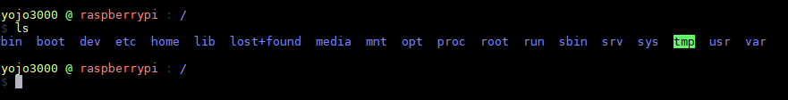

# bash_prompt

Make some change to the "sexy theme" of oh-my-bash repo

[Link to oh-my-bash](https://github.com/ohmybash/oh-my-bash)

Just install oh-my-bash and replace those two files to the origin one
```
cp bashrc ~.bashrc
cp sexy.theme.sh ~/.oh-my-bash/themes/sexy/
```


